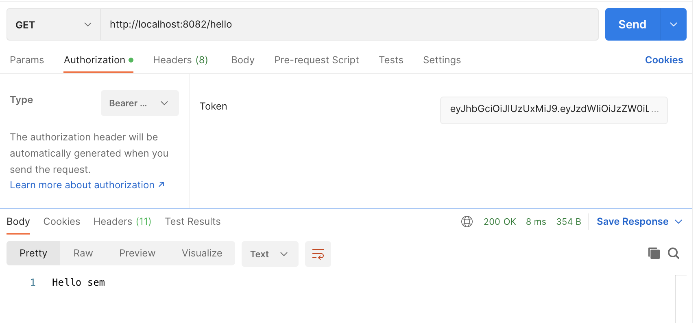
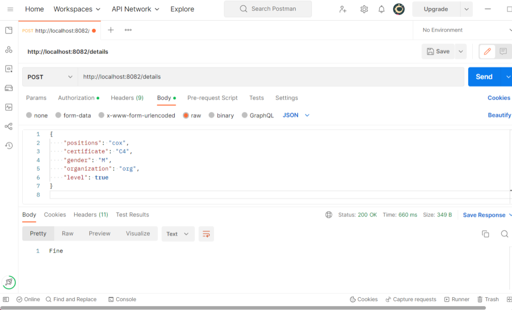
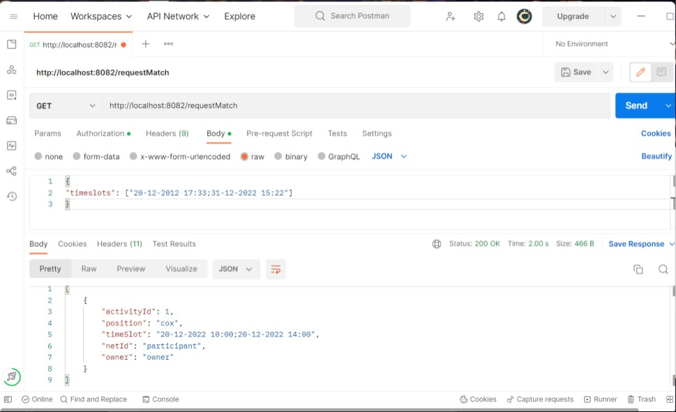
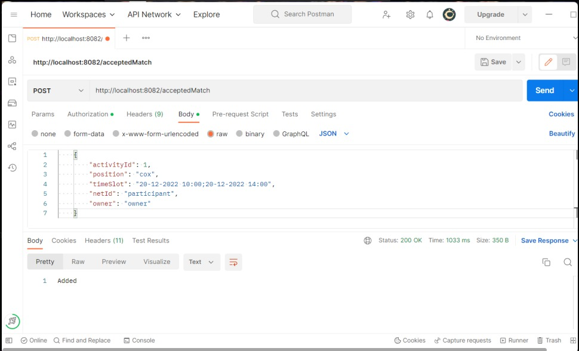
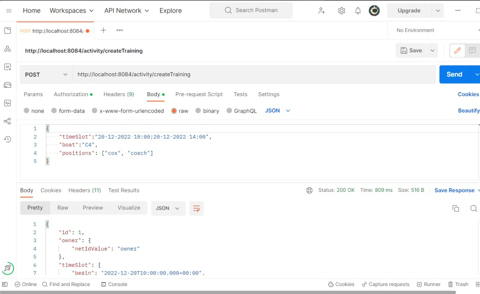
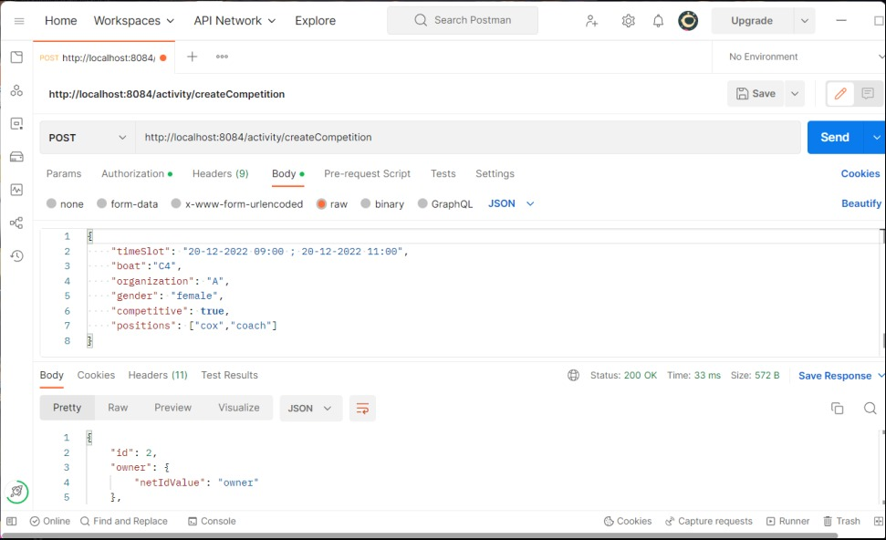
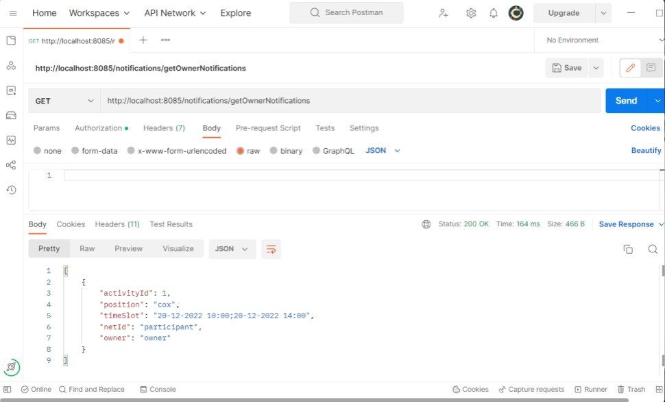
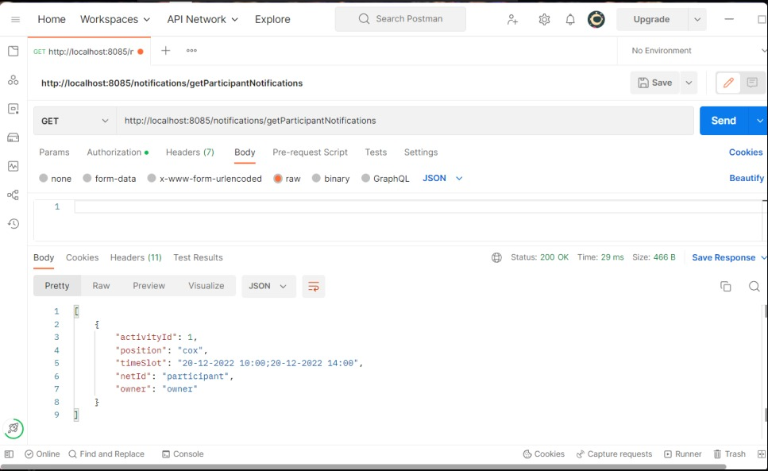
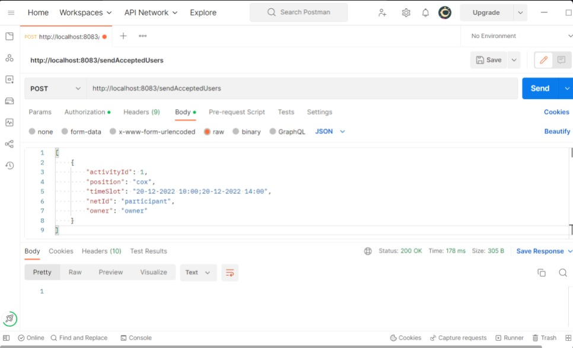

# Overview

This template contains five microservices:
-  authentication-microservice
- example-microservice (participant)
- activity-microservice
- matcher-microservice
- notification-microservice

The `authentication-microservice` is responsible for registering new users and authenticating current ones. After successful authentication, this microservice will provide a JWT token which can be used to bypass the security on all other microservices. The `example-microservice` takes care of the Participant functionality, such as adding and editing user details and accepting or requesting to participate in activities, action accomplished with the help of `activity-microservice`. The latter component contains endpoints capable of creating, editing and retrieving both competitions and training sessions. As for the selection part of the whole process of a user wanting to participate to an activity and being accepted or denied by the owner of said activity, it is taken care of by the `matcher-microservice`, the backbone of our application. Last but not least, in the presence of a user interface, the `notification-microservice` reacts to all interactions between participants and owners and notifies each user accordingly.

## Running the microservices

You can run the five microservices individually by starting the Spring applications. Then, you can use *Postman* to perform the different requests. Each json object used in *Postman* can be found in the jsonformats.txt.

## authentication-microservice

Register:
- Add the json object to the body of the request and send a POST request to http://localhost:8081/register

Authenticate:
- Add the json object to the body of the request and send a POST request to http://localhost:8081/authenticate

## example-microservice

### Hello:

- Add the bearer token to the `Authorization -> Bearer` field and send a GET request to http://localhost:8082/hello

### Adding user details:
- Add the json object to the body of the request and send a POST request to http://localhost:8082/details

### Requesting to partake in an activity:
- Add the json object to the body of the request and send a POST request to http://localhost:8082/requestMatch

### Accepting to partake in an activity:
- Choose one of the TransferMatch returned in the previous request and send a GET request to http://localhost:8082/acceptedMatch

## activity-microservice

### Creating a new Training session:
- Add the json object to the body of the request and send a POST request to http://localhost:8084/activity/createTraining

### Creating a new Competition:
- Add the json object to the body of the request and send a POST request to http://localhost:8084/activity/createCompetition

## notification-microservice

### Notifying an owner about the users who want to participate in their activity:
- Add the bearer token to the `Authorization -> Bearer` field and send a GET request to http://localhost:8085/notifications/getOwnerNotifications

### Notifying a participant about his approval to participate in an activity:
- Add the bearer token to the `Authorization -> Bearer` field and send a GET request to http://localhost:8085/notifications/getParticipantNotifications

## matcher-microservice

### Notifying the notification microservice that a user has been accepted:
- After making a request to getOwnerNotifications, choose a subset of the received TransferMatches, copy it into the body of this request and make a POST request to http://localhost:8083/sendAcceptedUsers

